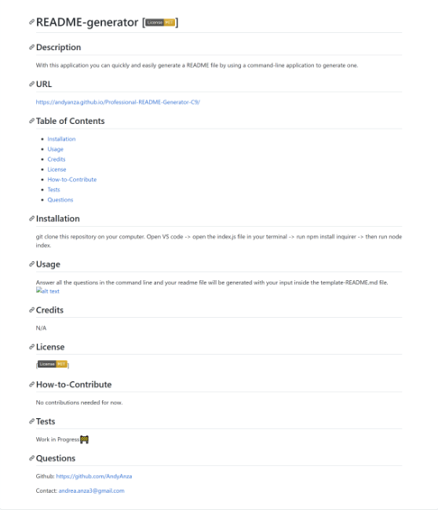

# Professional-README-Generator
With this application you can quickly and easily generate a README file by using a command-line application to generate one.

## Video
[Walkthrough Video](https://drive.google.com/file/d/18PsVGkDul8tpG4unsII3b0-y0dbWyyjH/view?usp=sharing)

## Table of Contents
- [Installation](#installation)
- [Usage](#usage)
- [Technologies](#technologies)
- [License](#license)

## Installation
git clone this repository on your computer. Open VS code -> open the index.js file in your terminal -> run npm install inquirer -> then run node index.

## Usage
Answer all the questions in the command line and your readme file will be generated with your input inside the template-README.md file.

## Technologies
- Javascript
- Node.js
- Inquirer

## License
N/A

