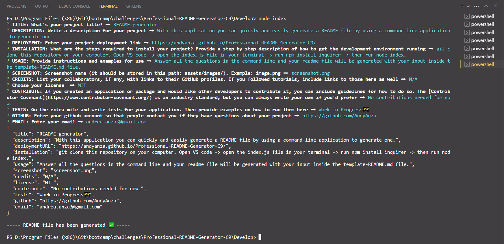

# Professional-README-Generator

## Description
With this application you can quickly and easily generate a README file by using a command-line application to generate one.

## Video
[Walkthrough Video](https://drive.google.com/file/d/18PsVGkDul8tpG4unsII3b0-y0dbWyyjH/view?usp=sharing)

## Table of Contents
- [Installation](#installation)
- [Usage](#usage)
- [License](#license)

## Installation
Just git clone this project into your command line.

## Usage
Right click on the index.js file and select Open in Integrated Terminal. Run node index in your command line and answer the questions. Once you have finished, your readme file will be generated with your input inside the template-README.md file.

## License
N/A

